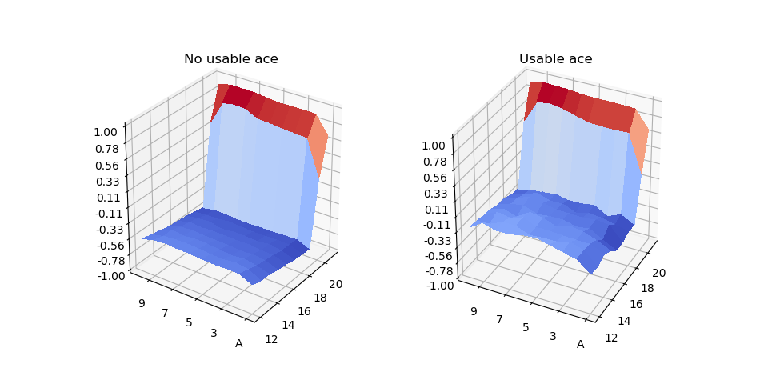

# Evaluating a blackjack player's policy

## First Visit Monte Carlo Policy Evaluation
This experiment is presented as an example in the book Reinforcement Learning an Introduction by Richard S. Sutton and Andrew G. Barto.

Using a monte carlo approach, the agent estimates the state value function V(s) while playing blackjack against the dealer.

Dealer's strategy: stick when sum > 16
Agent's strategy (policy): stick on 20 or 21

The state information of the environment consists of the dealer's face up card, the player's sum and whether the player has an ace that can be used as 1 instead of 11.

|  |
|:--:|
| *Estimation of the state value V(s) using the first visit Monte Carlo method. The agent's policy is sticking only on 20 or 21.* |