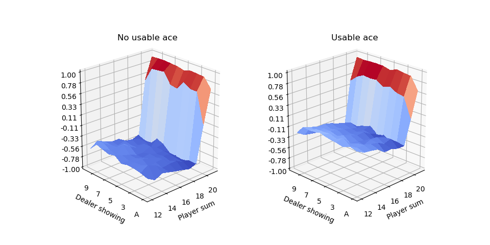

# Evaluating a blackjack player's policy

## First Visit Monte Carlo Policy Evaluation
This experiment is presented as an example in the book Reinforcement Learning an Introduction by Richard S. Sutton and Andrew G. Barto.

Using a monte carlo approach, the agent estimates the state value function V(s) while playing blackjack against the dealer.

* Dealer's strategy: stick when sum > 16
* Agent's strategy (policy): stick on 20 or 21

The state information of the environment consists of the dealer's face up card, the player's sum and whether the player has an ace that can be used as 1 instead of 11.

|  |
|:--:|
| *Estimation of the state value V(s) using the first visit Monte Carlo method. The agent was trained by playing 500.000 games.* |

The example_fvmc.py script can be used to generate new estimations and the plotting.py script can be used to plot the results as shown below:
```console
python example_fvmc.py --episodes 10000
python plotting.py
```

## TD(0) Policy Evaluation
In this experiment the agent estimates the state value function of the game using the TD(0) algorithm. The strategies of the dealer and the agent remain the same.

|  |
|:--:|
| *Estimation of the state value V(s) using the TD(λ) method. The agent was trained by playing 10.000.000 games.* |

The example_td0.py and plotting.py scripts can be used as shown below:
```console
python example.py --episodes 10000 --alpha 0.1 --discount_rate 0.8
python plotting.py
```

## TD(λ) Policy Evaluation
Here the TD(λ) algorithm is used to evaluate the state value function.
Parameters used are:
* lamda = 0.6
* a = 0.01

|  |
|:--:|
| *Estimation of the state value V(s) using the TD(λ) method. The agent was trained by playing 100.000 games.* |

The example_td_lamda.py and plotting.py scripts can be used as shown below:
```console
python example.py --episodes 10000 --lamda 0.6 --alpha 0.01
python plotting.py
```